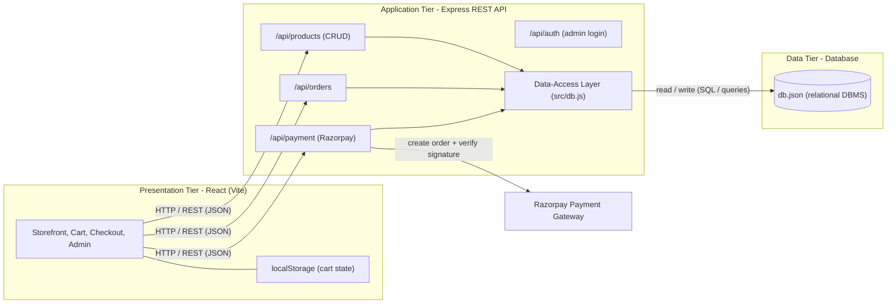
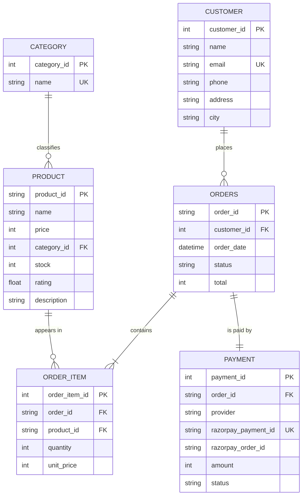

# ShopSphere - Database Design (DBMS)

V Meenakshi Iyer (2025SL70043), Mercy Mary (2025SL70043) | Database Systems - Assignment 1

This document presents the database design for ShopSphere: the ER diagram, the
relational schema (all tables, keys and constraints), the architecture diagram,
normalization notes, and how the current JSON store maps to a full relational
DBMS.

## 1. System Architecture (in relation to the DBMS)



The data-access layer (src/db.js) is the only component that talks to the
database. Swapping db.json for PostgreSQL or MySQL means changing only this
module; the API and UI stay identical.

## 2. Entity-Relationship (ER) Diagram



### Relationship summary (cardinality)

| Relationship | Type | Meaning |
|--------------|------|---------|
| CATEGORY to PRODUCT | 1 : N | one category has many products |
| CUSTOMER to ORDERS | 1 : N | a customer can place many orders |
| ORDERS to ORDER_ITEM | 1 : N | an order contains many line items |
| PRODUCT to ORDER_ITEM | 1 : N | a product can appear in many order lines |
| ORDERS to PAYMENT | 1 : 1 | each order has exactly one payment |

ORDER_ITEM is the associative (junction) entity that resolves the many-to-many
relationship between PRODUCT and ORDERS.

## 3. Relational Schema (Tables)

Notation: PK = primary key, FK = foreign key, UK = unique.

### 3.1 CATEGORY

| Column | Type | Constraints | Description |
|--------|------|-------------|-------------|
| category_id | INT | PK, AUTO_INCREMENT | Category identifier |
| name | VARCHAR(50) | UK, NOT NULL | e.g. Electronics, Fashion, Home, Books |

### 3.2 PRODUCT

| Column | Type | Constraints | Description |
|--------|------|-------------|-------------|
| product_id | VARCHAR(12) | PK | Product identifier (e.g. p1) |
| name | VARCHAR(120) | NOT NULL | Product name |
| price | INT | NOT NULL, CHECK (price >= 0) | Price in rupees (whole) |
| category_id | INT | FK to CATEGORY(category_id), NOT NULL | Category |
| stock | INT | NOT NULL, CHECK (stock >= 0) | Units available |
| rating | DECIMAL(2,1) | DEFAULT 0 | Average rating (0 to 5) |
| description | TEXT | | Long description |

### 3.3 CUSTOMER

| Column | Type | Constraints | Description |
|--------|------|-------------|-------------|
| customer_id | INT | PK, AUTO_INCREMENT | Customer identifier |
| name | VARCHAR(120) | NOT NULL | Full name |
| email | VARCHAR(120) | UK, NOT NULL | Email (login/identity) |
| phone | VARCHAR(15) | | Contact number |
| address | VARCHAR(255) | | Shipping address |
| city | VARCHAR(80) | | City |

### 3.4 ORDERS

| Column | Type | Constraints | Description |
|--------|------|-------------|-------------|
| order_id | VARCHAR(12) | PK | Order identifier (e.g. oab12cd) |
| customer_id | INT | FK to CUSTOMER(customer_id), NOT NULL | Who placed it |
| order_date | DATETIME | NOT NULL, DEFAULT NOW() | Timestamp |
| status | VARCHAR(20) | NOT NULL, DEFAULT 'Confirmed' | Order status |
| total | INT | NOT NULL | Order total in rupees |

### 3.5 ORDER_ITEM (junction table)

| Column | Type | Constraints | Description |
|--------|------|-------------|-------------|
| order_item_id | INT | PK, AUTO_INCREMENT | Line-item identifier |
| order_id | VARCHAR(12) | FK to ORDERS(order_id), NOT NULL | Parent order |
| product_id | VARCHAR(12) | FK to PRODUCT(product_id), NOT NULL | Product bought |
| quantity | INT | NOT NULL, CHECK (quantity > 0) | Units in this line |
| unit_price | INT | NOT NULL | Price at time of purchase |

### 3.6 PAYMENT

| Column | Type | Constraints | Description |
|--------|------|-------------|-------------|
| payment_id | INT | PK, AUTO_INCREMENT | Payment record id |
| order_id | VARCHAR(12) | FK to ORDERS(order_id), UK, NOT NULL | One payment per order |
| provider | VARCHAR(30) | NOT NULL, DEFAULT 'Razorpay' | Gateway used |
| razorpay_payment_id | VARCHAR(40) | UK | Razorpay payment id |
| razorpay_order_id | VARCHAR(40) | | Razorpay order id |
| amount | INT | NOT NULL | Amount paid in rupees |
| status | VARCHAR(20) | NOT NULL, DEFAULT 'Paid' | Payment status |

## 4. DDL - CREATE TABLE statements (SQL)

```sql
CREATE TABLE CATEGORY (
    category_id INT PRIMARY KEY AUTO_INCREMENT,
    name        VARCHAR(50) NOT NULL UNIQUE
);

CREATE TABLE PRODUCT (
    product_id  VARCHAR(12) PRIMARY KEY,
    name        VARCHAR(120) NOT NULL,
    price       INT NOT NULL CHECK (price >= 0),
    category_id INT NOT NULL,
    stock       INT NOT NULL CHECK (stock >= 0),
    rating      DECIMAL(2,1) DEFAULT 0,
    description TEXT,
    FOREIGN KEY (category_id) REFERENCES CATEGORY(category_id)
);

CREATE TABLE CUSTOMER (
    customer_id INT PRIMARY KEY AUTO_INCREMENT,
    name        VARCHAR(120) NOT NULL,
    email       VARCHAR(120) NOT NULL UNIQUE,
    phone       VARCHAR(15),
    address     VARCHAR(255),
    city        VARCHAR(80)
);

CREATE TABLE ORDERS (
    order_id    VARCHAR(12) PRIMARY KEY,
    customer_id INT NOT NULL,
    order_date  DATETIME NOT NULL DEFAULT CURRENT_TIMESTAMP,
    status      VARCHAR(20) NOT NULL DEFAULT 'Confirmed',
    total       INT NOT NULL,
    FOREIGN KEY (customer_id) REFERENCES CUSTOMER(customer_id)
);

CREATE TABLE ORDER_ITEM (
    order_item_id INT PRIMARY KEY AUTO_INCREMENT,
    order_id      VARCHAR(12) NOT NULL,
    product_id    VARCHAR(12) NOT NULL,
    quantity      INT NOT NULL CHECK (quantity > 0),
    unit_price    INT NOT NULL,
    FOREIGN KEY (order_id)   REFERENCES ORDERS(order_id),
    FOREIGN KEY (product_id) REFERENCES PRODUCT(product_id)
);

CREATE TABLE PAYMENT (
    payment_id          INT PRIMARY KEY AUTO_INCREMENT,
    order_id            VARCHAR(12) NOT NULL UNIQUE,
    provider            VARCHAR(30) NOT NULL DEFAULT 'Razorpay',
    razorpay_payment_id VARCHAR(40) UNIQUE,
    razorpay_order_id   VARCHAR(40),
    amount              INT NOT NULL,
    status              VARCHAR(20) NOT NULL DEFAULT 'Paid',
    FOREIGN KEY (order_id) REFERENCES ORDERS(order_id)
);
```

## 5. Sample Queries

```sql
-- All products in a category, cheapest first
SELECT p.name, p.price
FROM PRODUCT p JOIN CATEGORY c ON p.category_id = c.category_id
WHERE c.name = 'Electronics'
ORDER BY p.price ASC;

-- Full details of one order (header + line items)
SELECT o.order_id, o.order_date, p.name, oi.quantity, oi.unit_price
FROM ORDERS o
JOIN ORDER_ITEM oi ON o.order_id = oi.order_id
JOIN PRODUCT p     ON oi.product_id = p.product_id
WHERE o.order_id = 'oab12cd';

-- Total revenue per category
SELECT c.name AS category, SUM(oi.quantity * oi.unit_price) AS revenue
FROM ORDER_ITEM oi
JOIN PRODUCT p  ON oi.product_id = p.product_id
JOIN CATEGORY c ON p.category_id = c.category_id
GROUP BY c.name
ORDER BY revenue DESC;

-- Orders with their payment status
SELECT o.order_id, cu.name, o.total, pay.status, pay.razorpay_payment_id
FROM ORDERS o
JOIN CUSTOMER cu ON o.customer_id = cu.customer_id
JOIN PAYMENT  pay ON o.order_id   = pay.order_id;
```

## 6. Normalization

The schema is normalised to Third Normal Form (3NF):

- 1NF: every column holds atomic values; repeating groups (the items in an
  order) are moved to the ORDER_ITEM table.
- 2NF: no partial dependency; each non-key column depends on the whole primary
  key (for example, ORDER_ITEM.quantity depends on order_item_id).
- 3NF: no transitive dependency; category names live in CATEGORY, not repeated
  in PRODUCT, so a category rename touches one row.

unit_price is deliberately stored on ORDER_ITEM (not derived from PRODUCT.price)
so historical orders keep the price paid even if the product's current price
changes later.

## 7. How the Current JSON Store Maps to the Relational Model

The submitted app persists to a single db.json for simplicity. The mapping to
the relational design above is:

| JSON structure | Relational table(s) |
|----------------|---------------------|
| products[] | PRODUCT (plus CATEGORY extracted from the category field) |
| orders[].customer | CUSTOMER |
| orders[] (header: id, date, status, total) | ORDERS |
| orders[].items[] | ORDER_ITEM |
| orders[].payment | PAYMENT |

Because all persistence is funneled through backend/src/db.js, migrating to a
real RDBMS means implementing those same functions with SQL, with no changes to
the REST API or the React frontend.

## 8. Diagram Rendering Note

The diagrams above use Mermaid, which renders automatically on GitHub and in
VS Code (with a Mermaid preview extension). To export images, paste the code
blocks into https://mermaid.live.
